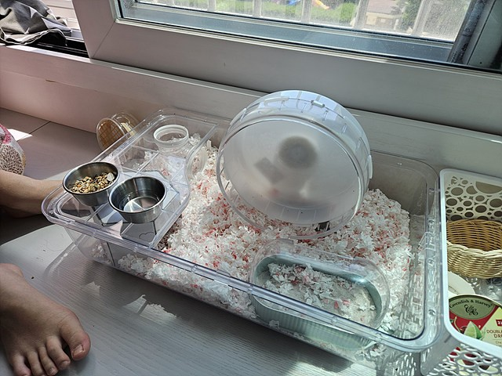

평화로운 일요일 아침. 갑자기 임자 집을 만들어 보기로 했다. 정확히는 은신처를 만들어 주기로 했다.

손을 다칠수 있다고 장갑을 끼고 칼질을 하라고 했다. 벗고 싶었지만, 참았다.

원래 학교에서 만든 육각 기둥 형태의 종이 연필꽂이였는데, 이걸 임자 집으로 만들어 보기로 했다.

입구를 넓게 만들어 주었다. 임자가 들어가기 편하게.

글루건을 쏘는 사진이 없는데, 힘들게 안쪽에 글루건을 쏴서 붙였다.

테이프로 한 번 더 튼튼하게 조립해 주었다.

입구는 충분히 넓게 만들어 주었지만, 임자가 배딩으로 입구를 막는다.ㅋㅋㅋ

이제 설치만 하면 끝이다. 애초에 사이즈를 측정해서 만들었기 때문에, 잘 맞아 들어간다.

완성! 임자가 들어가서 쉬어가는 모습을 얼른 보고 싶다. 사실 이미 봤닼ㅋㅋㅋ😆
