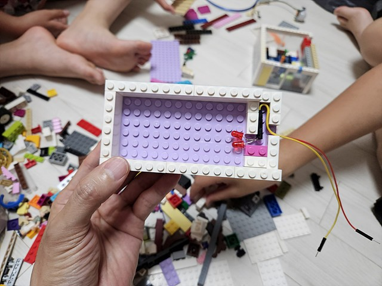
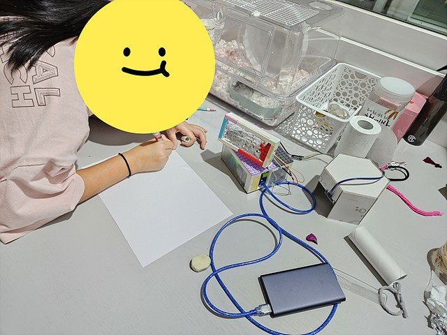
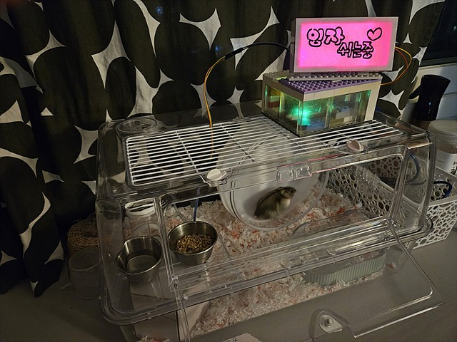

임자가 지난번에 만든 집안에 들어 가 있으면, 임자가 잘 있는지 확인이 안되니까 "임자가 쉬고 있어요"라는 간판을 만들어 주기로 했다. 🤔


아두이노 보드와 적외선 동작 감지 센서를 사용해서 뚝딱 만들었다.

```c
#define PIR_PIN_NUM 8 // PIR 센서 가운데 신호핀과 연결된 핀 번호
#define LED_PIN_NUM 9 // LED의 긴다리 핀과 연결된 아두이노 핀 번호 (+핀)
#define BOARD_LED_PIN_NUM 13 // 보드 LED 핀

void setup() { //setup은 처음 한 번 실행되는 함수 입니다.
  pinMode(LED_PIN_NUM, OUTPUT); // LED의 긴다리 핀을 출력으로 설정
  pinMode(BOARD_LED_PIN_NUM, OUTPUT); // 내부 LED의 긴다리 핀을 출력으로 설정
  pinMode(PIR_PIN_NUM, INPUT); // PIR 센서를 입력으로 설정
}

void loop() { //loop는 계속 반복 실행되는 함수 입니다.
  if (digitalRead(PIR_PIN_NUM)) {
    digitalWrite(LED_PIN_NUM, HIGH); // LED와 연결된 핀에 전압을 5V로 설정
    digitalWrite(BOARD_LED_PIN_NUM, HIGH);
  } else {
    digitalWrite(LED_PIN_NUM, LOW); // LED와 연결된 핀에 전압을 0V로 설정
    digitalWrite(BOARD_LED_PIN_NUM, LOW);
  }
}
```

동작 감지 센서가 잘 동작하는지 테스트 해보았다.


임자가 해도 잘 동작하는지 확인 완료! 임자둥절ㅎ😆


레고를 사용해서 간판을 만들었다. 레고를 사용하니까 쉽게 만들 수 있었지만, LED 부품을 고정하는 것이 어려웠다.


몇 번의 시행착오를 거쳐서 적당히 만듬ㅋ



덮개까지 만드니까 그럴듯하다.


불이 잘 들어오는지 테스트를 해봤다.


불이 좀 약한 것 같아서 뒤에 은박지를 붙여서 빛을 강하게 해주었다.


다음은 간판 디자인ㅋㅋㅋ



완성! 😎


빨간 불이 핑크빛으로 나와서 더 이쁘다.



더 자세한 내용을 [만드는 영상](https://www.youtube.com/watch?v=YBfybE94TPw)에서...
