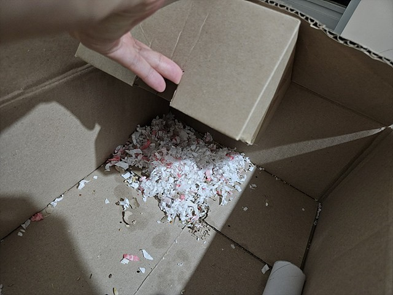

임자가 답답할 것 같아서 박스를 활용해서 놀이터를 만들어 주기로 했다. 재활용도 가능한 친환경 놀이터를 만들어보자!

가위로 박스를 잘라서 만들었다.

1차로 만들어진 집에 뚜껑을 덮어놓았더니 임자가 너무 좋아했다. 아침에 열어보니 자고 있었다. 졸귘ㅋㅋ

귀여움 한도 초과!!!ㅎ

자다 깨서 조금 당황한 모습ㅋㅋ

놀이터에 전망대를 만들어주기 위해서 구멍을 뚫었다.

임자도 바깥 세상을 보고 싶어할 것 같아서, 여러개 만들어 놓았다.

완성된 임자 전망대ㅎㅎ

임자가 놀이터로 만들어준 곳에 새로운 둥지를 만들었다. 배딩을 물고와서 스스로 둥지를 만들었다. 귀여운 녀석ㅎㅎ

더 자세한 내용은 [만드는 영상](https://youtu.be/IBTLPyfGM5M)에서...
