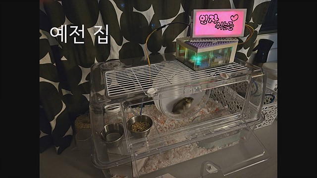
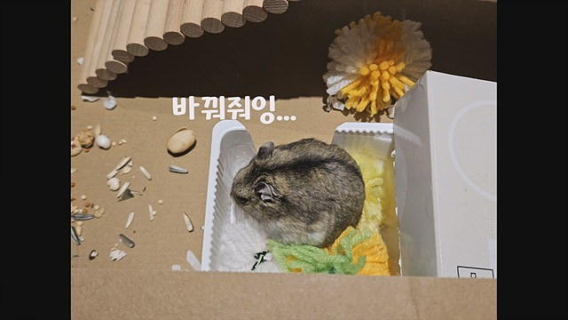

임자의 새로운 보금자리를 만들어 주었다. 사실 몇 번째인지 모르겠다. 임자가 새로운 곳을 좋아해서 여러번 바꿔주었다. 이번에는 더 큰 공간을 만들어 주었다. 임자가 더 편하게 쉴 수 있도록 노력했다.

임자의 첫번째 집은 투명 아크릴 집이다. 지금 생각해보면 작기도 하고, 사방이 막혀있어서 좀 답답했을 것 같다.

새로운 공간을 좋아하는 임자를 위해서 집을 여러차례 바꿔주었다. 

이케아에서 사온 수납함을 사용했는데, 일단 임자의 사생활 보호를 위해서 불투명한 재질을 사용했고, 최대한 널직한 공간을 만들어 주려고 노력했다.

다음 집은 2층집이다. 2층집은 1층집보다 넓은 공간을 제공했다. 통로를 만들어서 오르락 내리락을 할 수 있게 했다.

그리고 최근에는 2층집은 정리하고 1층에 두 개의 집을 연결해 주었다. 사실 하나는 놀이터다ㅋ 낮에만 개장한다.ㅎㅎ 마지막으로 편안하게 자고 있는 임자사진 투척! 배딩으로 푹신하게 만들던지, 모래를 사용하던지, 알아서 잠자리를 만들어서 누워서 자는 임자ㅋ😆

더 자세한 내용은 [새로운 집 소개 영상](https://youtu.be/tUcgJb6uygQ)에서...
